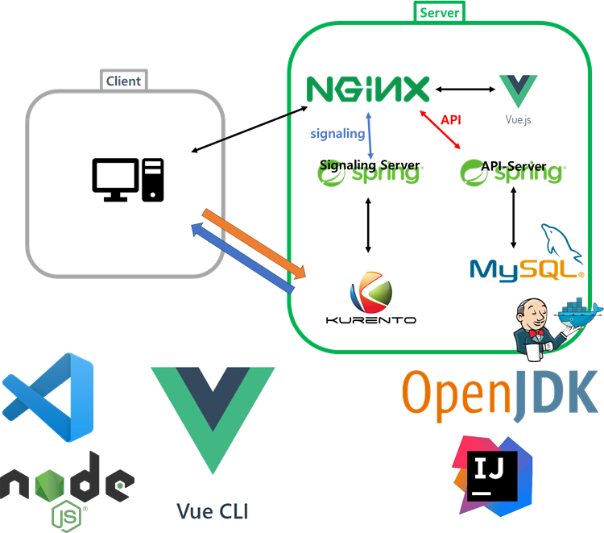

# Inline - Software and Tools

#### 1) Backend

- Openjdk - 1.8.0_192
- Intellij - 2021.2

#### 2) Frontend

- VSCode - 1.59.0
- node.js(npm) - 14.17.3
- vue/cli - 4.5.13

#### 3) AWS Server

- Ubuntu - 20.04.02 LTS
- Git - 2.25.1
- Docker - 20.10.8
- Dokcer-Compose - 1.25.0 - rc2
- Mysql - 8.0.26-0 ubuntu0.20.04.2
- NginX - 1.18.0
- Kurento - 6.16.1
- coturn - 3.14.1