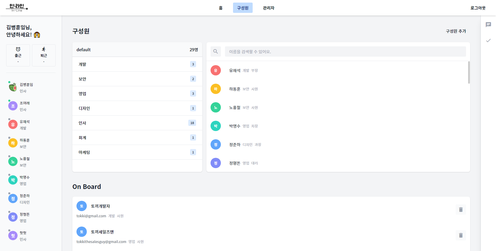
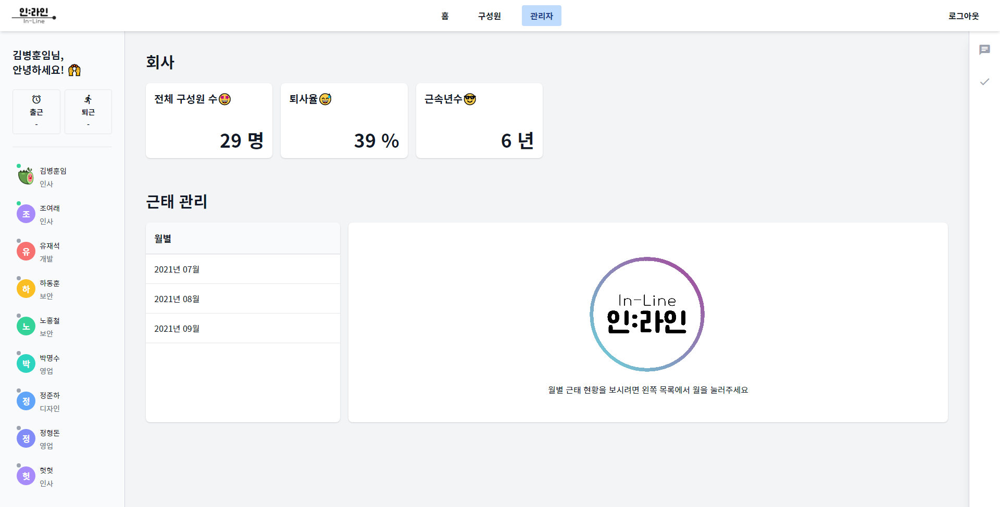
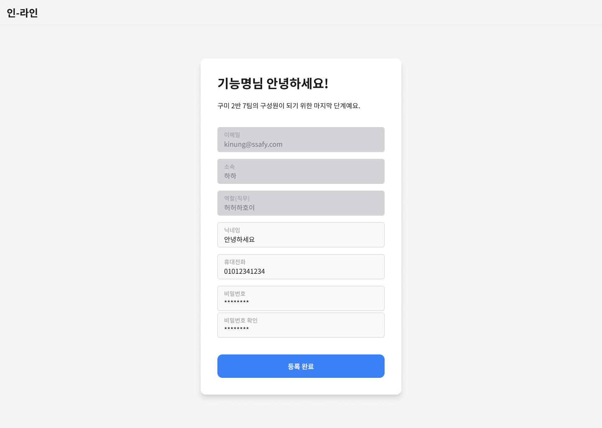
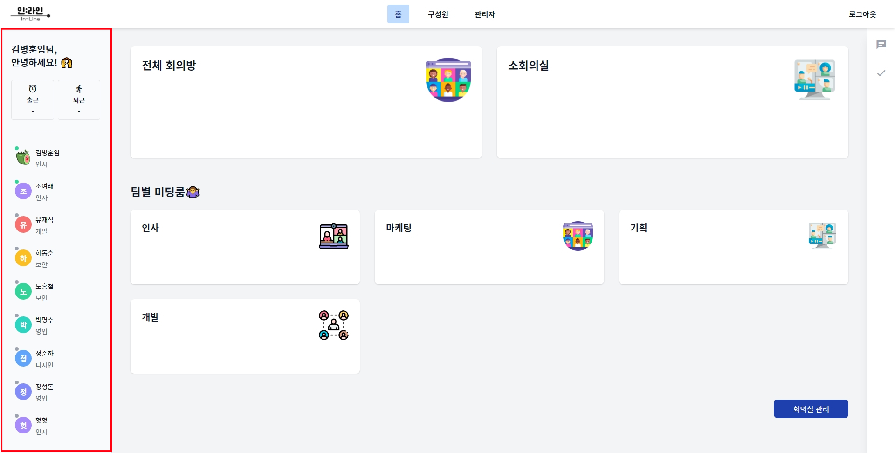
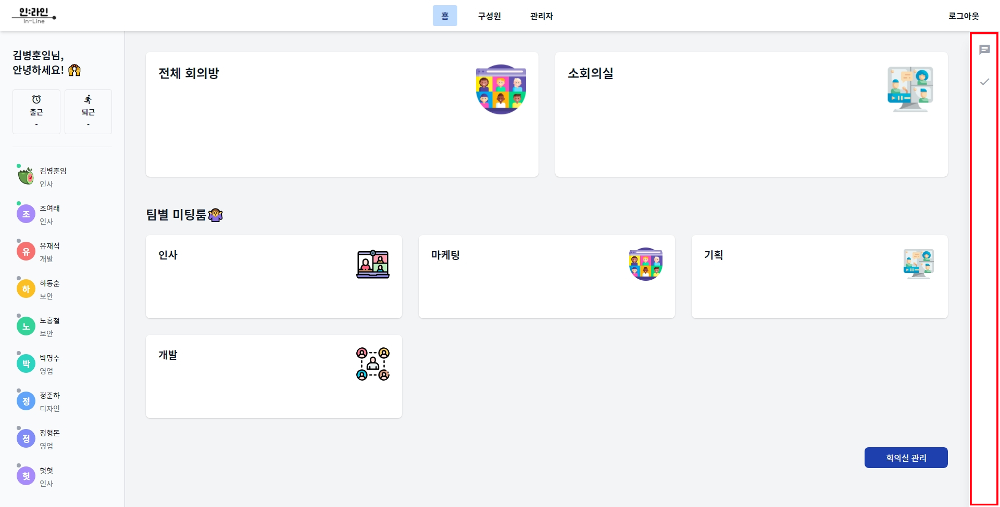
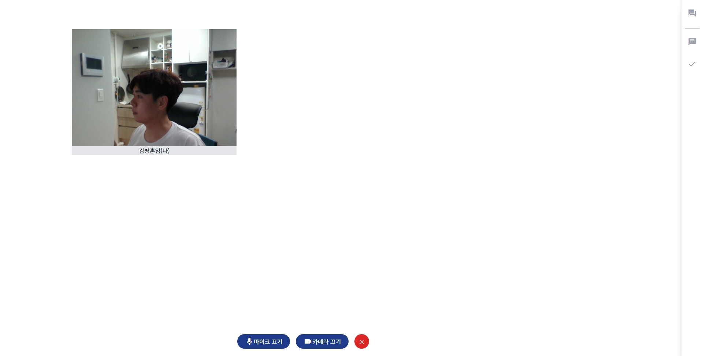

# 인라인 시연 시나리오

SSAFY 구미 7팀이 만든 서비스 "인:라인"은 이용자가 관리자 / 일반 구성원으로 나누어집니다.

# 관리자 시나리오

**회사 등록 → 로그인 → 회의실 → 구성원 → 관리자**

## 회사 등록

회사 등록은 `/`(랜딩 페이지) 의 상단 네비게이션 바에 있는 **회사 등록**을 통해 이루어집니다.

시나리오: 회사 이름 입력 → 관리자 정보 입력 → 관리자 비밀번호 입력

### 1. 회사 이름 입력

- 회사 이름을 입력하고 다음 단계로 넘어가며, 다음 단계로 넘어가기 전 중복된 회사 이름이 있는지 확인합니다.

### 2. 관리자(담당자) 정보 입력

- 회사를 등록하는 유저는 곧 관리자가 되며, 관리자도 곧 유저이기에 등록에 필요한 정보를 입력해야 합니다.
- 필수 정보
  - 이메일
  - 소속
  - 직책
  - 이름
  - 휴대전화
- 다음 단계로 넘어가기 전, 동일한 이메일이 존재하는 지 확인하는 절차를 거칩니다.

### 3. 관리자 비밀번호 입력

- 로그인 시 필요한 관리자의 비밀번호를 입력하는 단계입니다.
- 회사 등록하기 버튼을 누르면, 지금까지 입력한 정보를 전송하고, **회사 등록 절차를 마칩니다.**

## 로그인

페이지 주소: `/`

버튼 위치: 상단 네비게이션 우측

### 로그인

1. 로그인 버튼을 클릭하면, 로그인 모달이 활성화된다.
2. 이메일 / 비밀번호를 입력하고, 로그인한다.

- 이메일 기억하기를 선택한 후 로그인에 성공하면, 다음 로그인 시 이메일이 자동 입력
- **비밀번호를 잊으셨나요** 버튼을 클릭하면, 비밀번호 재설정 페이지로 이동(일반 구성원 시나리오)

## 회의실

페이지: `/office`

시나리오: 회의실 확인 → 회의실 생성 → 회의실 수정 → 회의실 삭제

우측 하단에 있는 "회의실 관리" 버튼을 통해 회의실을 관리할 수 있습니다.

### 1. 회의실 확인

1. "홈" 페이지에서 우리 회사의 회의실을 확인할 수 있습니다.
2. 다른 직원이 회의실에 들어가면, 회의실 버튼 좌측 하단에 어떤 구성원이 어떤 방에 들어갔는지 확인할 수 있습니다.

### 2. 회의실 생성

1. 회의실 관리 모달의 하단에 있는 **회의실 추가** 버튼을 클릭하면, 입력 창이 활성화됩니다.
2. 생성할 회의실 이름을 입력한 뒤 **회의실 추가하기** 버튼을 클릭하여, 회의실 생성 과정을 마칩니다.

- **취소** 버튼을 통해 입력 창을 비활성화 할 수 있습니다.
- 회의실 이름은 공란이 될 수 없기에 내용을 입력해야 **회의실 추가하기** 버튼이 활성화 됩니다.

### 3. 회의실 수정

1. 회의실 관리 모달에서 이름을 수정하고 싶은 회의실 우측에 있는 **편집** 버튼을 선택하면, 입력 창이 활성화됩니다.
2. 회의실 이름을 수정한 뒤, 우측에 있는 **확인** 버튼을 선택하면, 회의실 수정 과정이 마무리됩니다.

- 회사 등록 시 기본적으로 생성되는 "전체 회의방"과 "소회의실"은 이름을 변경할 수 없습니다.

### 4. 회의실 삭제

1. 회의실 관리 모달에서 삭제하고 싶은 회의실 우측에 있는 삭제 버튼을 선택하면, 회의실 삭제를 재확인하는 모달이 활성화 됩니다.
2. 확인을 누르면 회의실 삭제가 진행됩니다.

## 구성원

구성원 관리는 `/office/members`에서 이루어집니다.

시나리오: 구성원 확인 → 구성원 추가 → OnBoard 구성원 삭제 → 구성원 정보 수정 → 구성원 삭제

### 1. 구성원 확인

회사의 모든 구성원은 구성원 목록을 확인할 수 있지만, OnBoard는 관리자만 확인할 수 있습니다.

#### 구성원 섹션

1. 구성원 섹션의 왼쪽은 회사 이름과 부서 목록을 나타냅니다.
2. 부서 목록을 선택하면, 해당 부서의 구성원만 필터링되어 보여지게 됩니다.
3. 구성원 목록 상단에는 구성원 이름을 검색할 수 있는 검색창이 존재하며, 이를 통해 이름으로 필터링할 수 있습니다.
4. 구성원 목록에서 구성원을 선택하면, 해당 구성원의 정보를 확인할 수 있는 프로필 모달이 활성화됩니다.

#### 프로필 모달

 구성원의 프로필을 확인할 수 있습니다.

확인 가능 항목: 프로필 이미지 / 기본 정보

### 2. 구성원 정보 수정 (프로필 모달)

회사 구성원 정보 중 수정이 가능한 요소는 프로필 이미지 / 기본 정보 / 비밀번호이며, 관리자는 이 중 구성원의 기본 정보를 수정할 수 있습니다.

- 과정
  1. 구성원 목록에서 변경하고자 하는 구성원을 선택하고, 프로필 모달을 활성화 합니다.
  2. 기본정보 우측에 있는 수정 버튼을 클릭합니다.
     - 읽기 모드에서 수정 모드로 전환됩니다.
  3. 기본정보 수정 후 하단의 적용하기 버튼을 클릭합니다.
     - 변경 내용이 적용되며, 수정 모드에서 읽기 모드로 전환됩니다.

### 3. 구성원 삭제 (프로필 모달)

관리자는 자신을 제외한 다른 구성원을 삭제할 수 있습니다.

- 과정
  1. 구성원 목록에서 삭제하고자 하는 구성원을 선택하고, 프로필 모달을 활성화 합니다.
  2. 모달의 우측 하단에 있는 "회원탈퇴" 버튼을 클릭합니다.
  3. 재확인 모달이 활성화되며, 확인 버튼을 누르면 회원 탈퇴가 수행됩니다.

### 4. 구성원 추가

관리자는 회사의 구성원을 추가할 수 있습니다.

우측 상단에 있는 **"구성원 추가"** 버튼을 선택하면, "구성원 추가" 모달이 활성화 됩니다.

- 과정

  1. 구성원 추가 모달 활성화

  2. 필요 정보를 입력합니다.

     - 이름, 이메일, 소속, 역할

  3. 구성원 추가하기 버튼을 클릭합니다.

     - 인증 메일 발송

     - 입력한 정보는 OnBoard 테이블에 추가됩니다.

### 5. OnBoard 구성원 확인

구성원 추가를 통해 입력한 구성원의 정보는 하단의 OnBoard 섹션에서 확인할 수 있습니다.

확인 가능 정보: 이름 / 이메일 / 부서 / 역할

### 6. OnBoard 구성원 삭제

추가한 구성원의 등록이 완료되기 전, 구성원의 정보를 삭제할 수 있습니다.

- 과정
  1. 하단에 OnBoard 섹션에 추가한 구성원 목록을 확인합니다.
  2. 삭제하고 싶은 구성원의 오른쪽에 있는 삭제 버튼을 클릭합니다.
  3. 재확인 모달이 활성화되고, 확인 버튼을 선택하면 삭제가 완료됩니다.

## 관리자

페이지: `office/admin`

관리자 페이지에서는 회사의 간략한 현황과 직원들의 출퇴근 기록을 확인할 수 있습니다.

### 1. 회사 현황 확인

페이지 상단의 회사 섹션에서 확인할 수 있습니다.

확인 가능 정보: 현재 직원 수 / 퇴사한 직원 수 / 근속 년수

### 2. 출퇴근 기록 확인

출퇴근 기록을 확인하는 섹션은 좌측에 월 단위 버튼 목록 / 우측에 해당 월의 근무 기록 목록으로 나누어져 있습니다.

1. 좌측에 위치한 월 단위 버튼을 선택합니다.
2. 선택한 월에 해당하는 출퇴근 기록이 우측에 나타납니다.

---

# 일반 구성원 시나리오

## 회원가입

일반 구성원은 인라인 사이트에 직접 가입할 수 없습니다.

관리자의 초대 메일에 포함된 링크를 통해 접속한 페이지에서 가입을 진행합니다. 이는 일반 구성원이 반드시 회사에 연결되게 하기 위함입니다.

1. 페이지에 접속한 이용자는 가입을 위해 필요한 정보를 입력합니다.

   입력 정보: 닉네임 / 휴대전화 / 비밀번호 / 비밀번호 확인

2. 등록완료 버튼을 눌러, 회원가입 절차를 마무리합니다.

## 로그인

가입이 된 일반 구성원 역시 관리자와 동일한 방식으로 로그인합니다.

## 좌측 사이드바

### 1. 출근 / 퇴근

인라인의 모든 구성원은 좌측 사이드바의 상단에 있는 출/퇴근 버튼을 통해 근무 기록을 저장할 수 있습니다.

1. 좌측 사이드바 상단에 있는 출/퇴근 버튼을 클릭합니다.
2. 확인 모달이 활성화 되며, 현재 시간을 확인할 수 있습니다.
3. 확인 버튼을 클릭하면, 출근이 완료되며 출근 시간이 업데이트 됩니다.

- 출/퇴근 기록은 관리자가 관리자 페이지에서 확인할 수 있습니다.

### 2. 사무실 접속 현황

인라인의 모든 구성원은 좌측 사이드바의 하단에 있는 구성원 목록에서 현재 사무실에 접속한 구성원을 확인할 수 있습니다.

- 현재 사무실에 접속한 구성원은 프로필 이미지의 좌측 상단에 녹색불이 들어옵니다.

### 3. 다른 사람의 업무 확인

좌측 사이드바의 하단에 위치한 구성원 목록에서 구성원을 클릭하면, 해당 구성원의 업무를 확인할 수 있습니다.

## 우측 사이드바

### 전체 채팅

인라인의 모든 구성원은 우측 사이드바를 이용하여 모두가 확인할 수 있는 전체 채팅을 사용할 수 있습니다.

1. 우측 사이드바 채팅버튼을 선택하면, 전체채팅 영역이 활성화됩니다.
   - 이전 채팅 기록을 불러올 수 있습니다.
2. 채팅 영역 하단의 입력 칸을 통해 보내고 싶은 메세지를 입력한 후 "엔터"키를 누르면 메세지를 보낼 수 있습니다.

### 할 일

인라인의 모든 구성원은 우측 사이드바를 이용하여 TodoList를 만들 수 있습니다.

1. 우측 사이드바 할일 버튼을 선택하면, TodoList 영역이 활성화 됩니다.
   1. 할 일 추가
      1. 상단에 할 일 추가 버튼을 선택하면, 새로운 할 일을 추가할 수 있는 Form이 활성화됩니다.
      2. 제목 / 내용 / 일자를 입력하고 할 일 추가 버튼을 눌러 할 일을 추가합니다.
   2. 할 일 완료 / 완료 취소
      1. 완료할 할 일 우측에 있는 체크 버튼을 클릭합니다.
   3. 할 일 삭제
      1. 삭제할 할 일 우측 하단에 있는 삭제 버튼을 클릭합니다.
      2. 확인 모달이 활성화되며, 모달의 확인 버튼을 클릭하여 삭제 작업을 완료합니다.

## 구성원

페이지: `/office/members`

구성원은 본인의 프로필 사진 및 기본정보, 비밀번호를 변경할 수 있습니다.

### 1. 본인 프로필 수정

구성원 목록 중 본인 프로필을 선택합니다.

#### 프로필 사진 수정

1. 프로필 모달 상단의 프로필 사진의 우측 하단에 있는 수정 버튼을 클릭
2. 변경하고 싶은 이미지 파일을 선택 => 변경 완료

#### 프로필 변경 (기본정보)

관리자의 프로필 변경과 동일

### 2. 비밀번호 변경

1. 프로필 모달 우측 하단에 있는 비밀번호 변경을 클릭하여, 비밀번호 변경 페이지로 이동
2. 이전 비밀번호, 새 비밀번호, 새 비밀번호 확인을 입력하고 "비밀번호 변경 완료" 버튼을 클릭하여 비밀번호 변경 완료

## 회의실

`/office`에 있는 회의실 중 입장하고 싶은 회의실을 선택하여 입장합니다.

### 1. 마이크 및 카메라 On/Off

#### 마이크 On/Off

1. 회의실 하단에 있는 마이크 끄기를 선택합니다. => 마이크 Off
2. 회의실 하단에 있는 마이크 켜기를 선택합니다. => 마이크 On

#### 카메라 On/Off

1. 회의실 하단에 있는 카메라 끄기를 선택합니다. => 카메라 Off
2. 회의실 하단에 있는 카메라 켜기를 선택합니다. => 카메라 On

### 2. 회의실 채팅

1. 우측 사이드바, 가장 상단에 있는 채팅 아이콘을 선택하면 채팅 영역이 활성화 됩니다.
2. 채팅 영역 하단에 있는 입력 칸에 보낼 채팅을 입력하고 엔터를 통해 채팅을 전송합니다.

